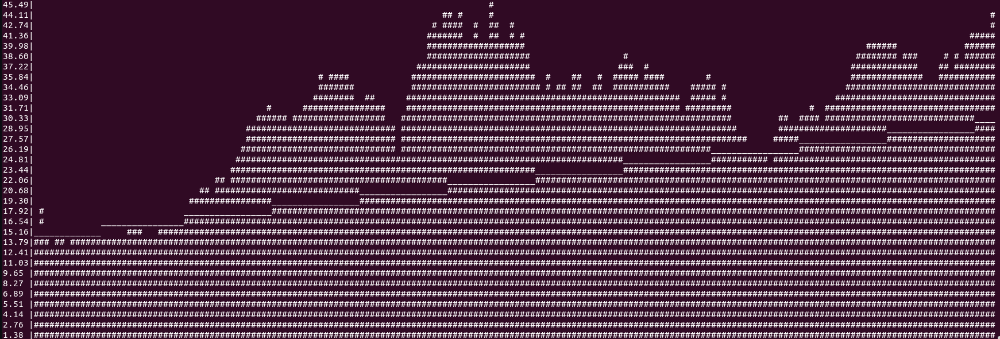

# Console stock chart

First ever written application in Rust. Mainly for learning purposes.

## Functionality

App takes .csv data from project root path, parses it and displays in console.
Additionally application performs Simple Linear Regression which is 
pointed with '_' char.

## TODO
* [ ] termion
* [ ] cleanup code
* [ ] error handling
* [ ] customize data path
* [ ] somehow display candlestick chart
* [ ] some concurrency?